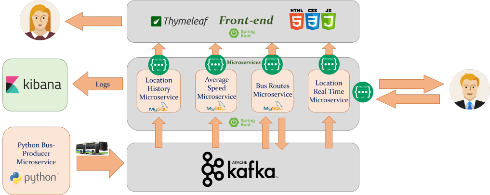

# Digital Twins

## Concept
A digital twin is a digital replica of an entity. There may be virtual counterparts of people, places, devices or systems. The digital twins concept emphasizes the connection between the physical model and its virtual counterpart. In a world full of technology, the digital twin concept is used in several areas, such as IoT, AI and software analytics/development. The idea is to create digital simulation models that change as their physical counterparts change.

## Architecture
The information available on the dataset is used by the Bus-Producer microservice that communicates it to the other microservices via Kafka broker.
Each of the microservices sends information to the front-end so that the end users can check the bus locations, bus average speed, etc…
If a user wants to add a new bus or a new route, he can connect to the Bus Routes microservice via a RESTful API and he can also access every other microservices’ available data via that same RESTful API.

The system consists on 6 microservices. One of them was coded in Python and the remaining 5 using Java Springboot.

* Bus-producer
  * Technologies used: Python, ApacheKafka
  * Feature: This microservice’s purpose is to send bus data, from a given dataset, to all other microservices, using a Kafka Producer.

* Average-speed
  * Technologies used: Java (Springboot), ApacheKafka, MySQL
  * Feature: This microservice’s purpose is to calculate a given bus’s average speed by accessing its data in the local database. This data is available through a REST API.

* Bus-routes
  * Technologies used: Java (Springboot), ApacheKafka, MySQL
  * Feature: This microservice’s purpose is to check all of a bus’s locations and return its route, as well as convey information regarding new locations to other microservices using a kafka producer. This information is available through a REST API.
  * Running on: a Docker container named esp41-digital-twins-bus-routes, on port 41002

* Location-history
  * Technologies used: Java (Springboot), ApacheKafka, MySQL
  * Feature: This microservice’s purpose is to store and display a given bus’s location history. The information is available through a REST API.

* Locations-rt (real time)
  * Technologies used: Java (Springboot), ApacheKafka, MySQL
  * Feature: This microservice’s purpose is to update the local database’s information regarding a bus’s last position (current one). This information is available through a REST API.

* Frontend
  * Technologies used: Java (Springboot), ApacheKafka, MySQL

The system can be expanded by creating and adding more microservices for whatever data the developer may find useful. If the developer wants to create a new microservice he must follow the following steps:

* Create a new folder in the root directory for the new microservice;
* Create a new Dockerfile for the new microservice;
* Add the configuration to the jenkins file to deploy;
* Add the new microservice to the docker-compose-deploy.yml;

